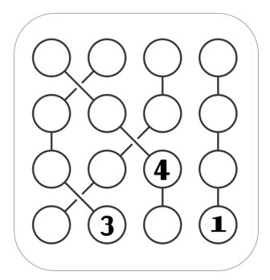

# Strimko Puzzle Solver

This repository contains a Python program to solve Strimko puzzles, a logic-based number puzzle. It also includes functionality to solve Sudoku puzzles and visualize the game boards.

## About the Game

[Strimko](https://en.wikipedia.org/wiki/Strimko) is a logic number puzzle that uses only three basic elements: **rows**, **columns**, and **streams**. All elements have an equal number of cells, and the goal is to make each row, column, and stream contain the whole set of specified numbers. Cells in the grid are organized into several streams of equal length. In *this implementation*, streams can be formed by cells that are not necessarily adjacent (i.e., they can be disconnected).

Sudoku can be considered a specific type of Strimko puzzle where the "streams" are the 3x3 non-overlapping boxes. This solver handles Sudoku as a special case of Strimko.

<p align="center">
Below is an example of a 4x4 Strimko puzzle before and after solving:
</p>
<p align="center">
<table>
  <tr>
    <td align="center"><strong>4x4 Strimko (Unsolved)</strong></td>
    <td align="center"><strong>4x4 Strimko (Solved)</strong></td>
  </tr>
  <tr>
    <td align="center"></td>
    <td align="center"></td>
  </tr>
</table>
</p>

## Features

* Solves Strimko puzzles of various sizes.
* Capable of solving Sudoku puzzles (specifically 9x9, treated as a Strimko variant).
* Handles streams (links) where the constituent cells may not be contiguous.
* Solves puzzles where streams may not have equal lengths, as streams are defined by a flexible number of cells.
* Implements a Constraint Satisfaction Problem (CSP) solving algorithm.
* Provides a graphical user interface (GUI) to visualize the puzzle board and its solution using `matplotlib` and `networkx`.
* Allows initialization of puzzles with pre-filled values.
* Utilizes NumPy for efficient array manipulations, enhancing performance.

## How it Works: CSP Algorithm to Solve the Puzzle

The core solving logic is implemented in the `solver_csp` method within the `board.py` file. The algorithm is designed for puzzles that have a unique solution and where each step has a logically deducible cell and number. This characteristic makes a backtracking approach unnecessary, as the solver can proceed by direct inference.

The general steps of the algorithm are:

1.  **Initialization**:
    * The board is initialized with a given size, and optionally, as a Sudoku puzzle.
    * Possibility sets for each cell are implicitly managed and updated.

2.  **Iterative Solving Loop**: The algorithm iterates a number of times equal to the total number of cells minus the already assigned cells. In each iteration:
    * **Update Possibilities (`fill_possibilities`)**: For every empty cell, determine its set of possible values by eliminating numbers already present in its row, column, and stream.
    * **Single Possibility Check**: Iterate through all cells:
        * If a cell has only one remaining possible value in its updated possibility set, assign this value to the cell.
    * **Unique Possibility in Constraint Group Check**: If a cell has more than one possible value, the algorithm checks if one of these values is unique within the context of its associated constraints (row, column, or stream).
        * **Row Uniqueness**: For the current cell's row, count the occurrences of each number across all possibility sets of cells in that row. If a number appears only once in these collective possibilities, and that number is a possibility for the current cell, then that number is assigned to the cell.
        * **Column Uniqueness**: Perform a similar check for the current cell's column.
        * **Stream Uniqueness**: Perform a similar check for the current cell's stream (link).

3.  **Termination**:
    * The loop continues until the board is solved or the maximum number of iterations is reached.

## Examples in Action

<p align="center">
Here are some visual examples of the solver's output, showing the unsolved and solved states side-by-side:
</p>
<p align="center">
<table>
  <tr>
    <td align="center"><strong>6x6 Strimko Puzzle (Unsolved)</strong></td>
    <td align="center"><strong>6x6 Strimko Puzzle (Solved)</strong></td>
  </tr>
  <tr>
    <td align="center"></td>
    <td align="center"></td>
  </tr>
  <tr>
    <td align="center"><strong>9x9 Sudoku Puzzle (Unsolved)</strong></td>
    <td align="center"><strong>9x9 Sudoku Puzzle (Solved)</strong></td>
  </tr>
  <tr>
    <td align="center"></td>
    <td align="center"></td>
  </tr>
</table>
</p>

## Files in the Repository

* `board.py`: Contains the `strimko` class which defines the puzzle board, its properties (size, links/streams), methods for adding values, defining streams, checking constraints (rows, columns, links), and the core CSP solver logic (`solver_csp`).
* `gui.py`: Provides the `draw` function to visualize the Strimko board using `networkx` for graph representation and `matplotlib` for plotting. It colors cells based on their stream and displays the numbers.
* `main.py`: Includes example usage of the `strimko` class and the `draw` function. It demonstrates how to initialize different Strimko and Sudoku puzzles, add initial values, solve them, and display the results.

## Usage/Examples

The `main.py` file provides examples of how to set up and solve Strimko and Sudoku puzzles.

```python
from board import strimko
from gui import draw

# Example: 4x4 Strimko
x = strimko(size=4)

# Define streams (links)
x.new_link('00','11','22','32')
x.new_link('01','10','20','31')
x.new_link('02','12','21','30')
x.new_link('03','13','23','33')

# Add initial values
x.add_value(2,2,4)
x.add_value(3,1,3)
x.add_value(3,3,1)

print('Board before being solved:')
print(x)
draw(x) # Display initial board

x.solver_csp() # Solve the puzzle

print('========\nAfter solving: \n ')
print(x)
assert x.is_solved()
draw(x) # Display solved board
```

To run other examples, uncomment the relevant sections in main.py.

## Dependencies
- `numpy` (used in `board.py` and `gui.py`)
- `matplotlib` (used in `gui.py`)
- `networkx` (used in `gui.py`)

You can typically install these using pip:
```bash
pip install numpy matplotlib networkx
```
